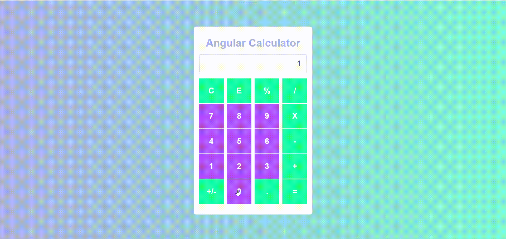

# 🧮 Angular Calculator

Uma calculadora matemática simples com Angular.

<div align="center">
  
</div>

### ⚒️ Technologies
- Angular
- SCSS
- input/output

## 📚 How to use
Download
```bash
git clone https://github.com/jordan-will/angular-calculator
```
Access the folder
```bash
cd angular-calculator
```
Install dependencies
```bash
npm install
```
Start the project
```bash
npm start
```
## 🌐 Live example
You can access live [here](https://jordan-will.github.io/angular-calculator/)
